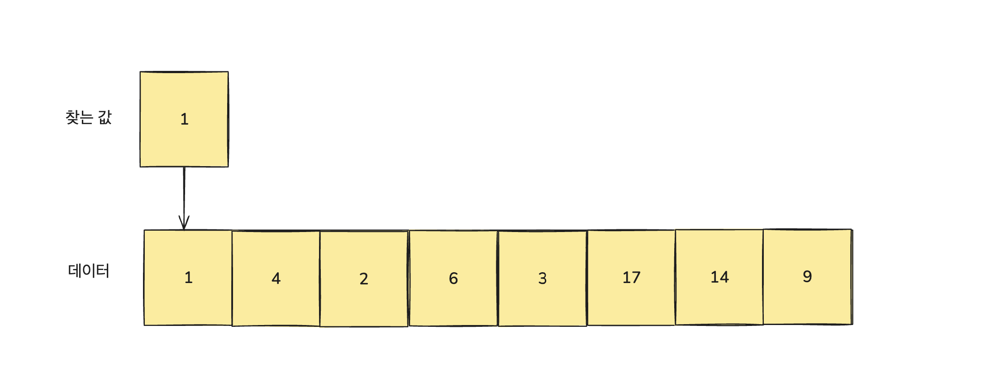
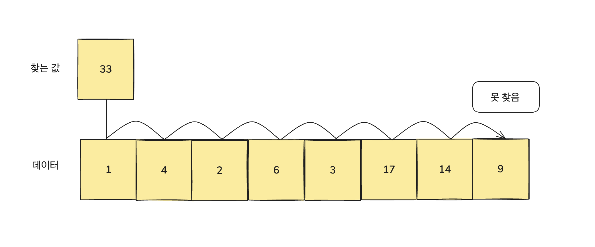
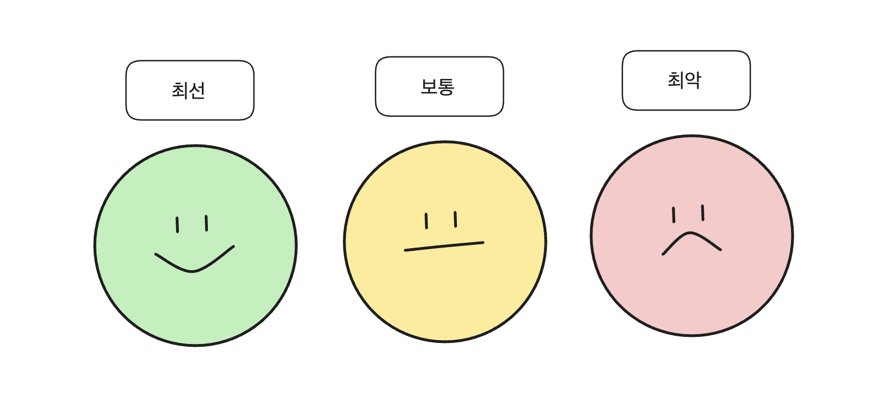

# 알고리즘의 효율 분석

**🗒️ 목차**

```
03-1 시간 복잡도란?
03-2 시간 복잡도 계산해보기
```

## 03-1 시간 복잡도란?

시간 복잡도<sup>time complexity</sup>
알고리즘의 성능을 나타내는 지표로, **\*입력 크기**에 대한 연산 횟수의 상한을 의미합니다. 시간 복잡도는 낮으면 낮을수록 좋습니다.

**\*입력 크기** : 알고리즘이 처리해야할 데이터의 양

### 1차원 배열 검색하기

1차원 배열에 값이 있을 때 특정 값을 배열의 맨 앞에서 순서대로 검색한다고 해봅시다.
이때 연산 횟수가 가장 적을 때와 가장 많을 때는 언제일까요?

#### 연산 횟수가 가장 적은 경우

검색 시작 위치에 찾을 값이 바로 있는 경우


#### 연산 횟수가 가장 많은 경우

아예 찾으려는 값이 없거나 가장 마지막에 위치하는 경우


### 알고리즘 수행 시간을 측정하는 방법

#### 절대 시간을 측정하는 방법

**말 그대로 시간을 측정하면 됩니다.**
예를 들어 배열에서 검색하는 프로그램을 작성한 다음에 프로그램을 실행하여 걸과가 나올 때까지의 시간을 측정하면 됩니다.
**그러나 이 방법은 프로그램을 실행하는 환경에 따라 달라질 수 있어서 코딩 테스트에서는 잘 활용하지 않습니다.**

#### 시간 복잡도를 측정하는 방법

시간 복잡도는 알고리즘이 시작한 순간부터 결과값이 나올 때까지의 연산 횟수를 나타냅니다.
그리고 시간 복잡도를 측정한 결과는 다음과 같이 최선<sup>best</sup>, 보통<sup>normal</sup>, 최악<sup>worst</sup>의 경우로 나눕니다.


앞에서는 '배열 맨 앞부터 하나씩 검사하기' 알고리즘을 사용했습니다.
이 알고리즘은 상황에 따라 최선의 연산 횟수는 1번, 최악의 연산 횟수는 8번이었죠.

**시간 복잡도를 표현할 방법이 필요합니다**
**첫째, 최악의 경우를 고려하라**
**둘째, 알고리즘 성능은 정확한 연산 횟수가 아닌 추이를 활용한다.**

### 최악의 경우 시간 복잡도를 표현하는 빅오 표기법

### 시간 복잡도를 코딩 테스트에 표현하는 방법

## 03-2 시간 복잡도 계산해보기
