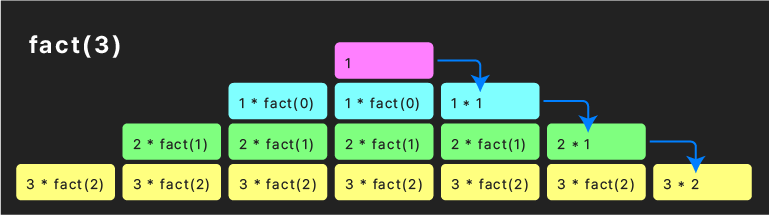

# 04 리액트 핵심 요소 깊게 살펴보기

## 1. 중첩된 함수

```js
function outer() {
  const name = "바깥쪽";
  console.log(name, "함수");

  function inner() {
    const name = "안쪽";
    console.log(name, "함수");
  }
  inner();
}

outer();
```

스택

```
inner name = '안쪽'
outer name = '바깥쪽'
```

## 2. 재귀 함수(recursive function)

```js
function upto5(x) {
  console.log(x);
  if (x < 5) {
    upto5(x + 1);
  } else {
    console.log("- - -");
  }
}

upto5(1);
upto5(3);
upto5(7);
```

- 스택이 넘치면 stack overflow - 오류 발생

### 💡 팩토리얼 factorial 재귀함수

```js
function fact(x) {
  return x === 0 ? 1 : x * fact(x - 1);
}

console.log(fact(1), fact(2), fact(3), fact(4));
```



## 2. 재귀 함수(IIFE)

Immideately Invoked Function Expression

- 오늘날에는 잘 사용되지 않음
- 과거 코드 분석을 위해...

```js
(function () {
  console.log("IIFE");
})();
```

### 💡 무엇에 사용되었는가?

```js
let initialMessage;

{
  const month = 8;
  const day = 15;
  const temps = [28, 27, 27, 30, 32, 32, 30, 28];
  let avgTemp = 0;
  for (const temp of temps) {
    avgTemp += temp;
  }
  avgTemp /= temps.length;

  initialMessage = `${month}월 ${day}일 평균기온은 섭씨 ${avgTemp}도입니다.`;
}

console.log(initialMessage);
console.log(month); // 새로고침 후 const를 var로 바꾸고 실행해볼 것
```

- 딱 한 번만 사용될 함수에 전역 변수들을 사용하지 않고, 복잡한 기능을 일회성으로 실행할 때
  다른 코드들과의 변수명이나 상수명 충돌을 막기 위함 (특히 많은 코드들이 사용될 때)
- 오늘날에는 블록과 이후 배울 모듈의 사용으로 대체
  - 이전의 var는 블록 외에서 사용될 수 있었음(‼️)

```js
let initialMessage;

{
  const month = 8;
  const day = 15;
  const temps = [28, 27, 27, 30, 32, 32, 30, 28];
  let avgTemp = 0;
  for (const temp of temps) {
    avgTemp += temp;
  }
  avgTemp /= temps.length;

  initialMessage = `${month}월 ${day}일 평균기온은 섭씨 ${avgTemp}도입니다.`;
}

console.log(initialMessage);
console.log(month); // 새로고침 후 const를 var로 바꾸고 실행해볼 것
```

## ⭐️ 불변성 immutability

```js
let x = 1;
let y = {
  name: "홍길동",
  age: 15,
};
let z = [1, 2, 3];

function changeValue(a, b, c) {
  a++;
  b.name = "전우치";
  b.age++;
  c[0]++;

  console.log(a, b, c);
}

changeValue(x, y, z);
/// 2 {name: '전우치',age: 16} [2, 2, 3]
```

```js
console.log(x, y, z);
/// 1 {name: '전우치',age: 16} [2, 2, 3]
```

**원시 타입 : 인자로 들어간 함수 내에서의 변경에 영향 받지 않음**

- 실제 값이 아니라 **복사된 값**이 들어갔기 때문

**참조 타입 : 인자로 들어간 함수 내에서 요소가 변하면 실제로도 변함**

- **복사된 값도 같은 객체나 배열을 가리키기** 때문

⭐️ **함수에 주어진 인자를 변경하는 것은 좋지 않음**

- ⚠️ 외부의 환경을 변경하는 함수는 위험!
- 이상적인 함수: 받은 값들만 처리하여 새 값을 반환
