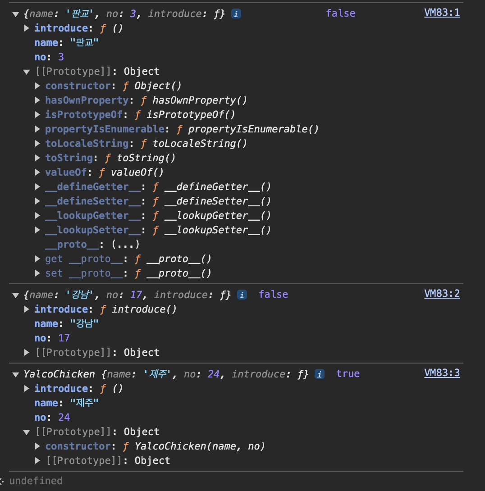

# 💡 생성자 함수의 필요성

```js
// 얄코치킨의 체인점을 나타내는 객체들

const chain1 = {
  name: "판교",
  no: 3,
  introduce() {
    return `안녕하세요, ${this.no}호 ${this.name}점입니다!`;
  },
};

const chain2 = {
  name: "강남",
  no: 17,
  introduce() {
    return `안녕하세요, ${this.no}호 ${this.name}점입니다!`;
  },
};

const chain3 = {
  name: "제주",
  no: 24,
  introduce() {
    return `안녕하세요, ${this.no}호 ${this.name}점입니다!`;
  },
};

// 이처럼 같은 형식의 객체들을 다수 만들어야 한다면?
```

## 1. 생성자 함수로 객체 만들기

```js
// 생성자 함수
function YalcoChicken(name, no) {
  this.name = name;
  this.no = no;
  this.introduce = function () {
    return `안녕하세요, ${this.no}호 ${this.name}점입니다!`;
  };
}
// 인스턴스 생성
const chain1 = new YalcoChicken("판교", 3);
const chain2 = new YalcoChicken("강남", 17);
const chain3 = new YalcoChicken("제주", 24);

console.log(chain1, chain1.introduce());
console.log(chain2, chain2.introduce());
console.log(chain3, chain3.introduce());
```

- 생성자 함수명은 일반적으로 대문자로 시작 - 파스칼 케이스
- 생성자 함수로 만들어진 객체를 인스턴스 instance 라 부름
- this.~로 생성될 인스턴스의 프로퍼티들 정의
- 생성자 함수는 new 연산자와 함께 사용
- 암묵적으로 this 반환
- 생성자 함수에서는 메서드 정의 불가 - 객체 리터럴과 클래스에서는 가능

## ⚠️ new를 붙이지 않으면 undefined 반환

```js
function YalcoChicken(name, no) {
  this.name = name;
  this.no = no;
  this.introduce = function () {
    return `안녕하세요, ${this.no}호 ${this.name}점입니다!`;
  };
}

console.log(YalcoChicken("홍대", 30));
```

- 호출시 new를 붙이는가 여부에 따라 호출 원리가 다름

## function으로 선언된 함수는 기본적으로 생성자 함수의 기능을 갖음

```
founction doNothing(){};
console.log(new doNothing()); // 빈 객체를 반환
```

doNothing {}
\[[prototype]]: Object

## 💡 "객체를 반환하는 함수랑은 뭐가 다르지??"

```js
function createYalcoChicken(name, no) {
  return {
    name,
    no,
    introduce() {
      return `안녕하세요, ${this.no}호 ${this.name}점입니다!`;
    },
  };
}

const chain1 = createYalcoChicken("판교", 3);
const chain2 = createYalcoChicken("강남", 17);
const chain3 = createYalcoChicken("제주", 24);

console.log(chain1, chain1.introduce());
console.log(chain2, chain2.introduce());
console.log(chain3, chain3.introduce());
```

## 2. 생성자 함수로 만들어진 객체

### 1. 프로토 타입 prototype - 자바스크립트 객체지향의 중심

처음엔 클래스 개념이 없었음 이후 프로토 타입을 사용해 추가됨.

```js
function YalcoChicken(name, no) {
  this.name = name;
  this.no = no;
  this.introduce = function () {
    return `안녕하세요, ${this.no}호 ${this.name}점입니다!`;
  };
}

const chain1 = new YalcoChicken("판교", 3);
console.log(chain1);
```

```js
// 본사에서 새 업무를 추가
// 프로토타입: 본사에서 배포하는 메뉴얼이라고 이해
YalcoChicken.prototype.introEng = function () {
  return `Welcome to Yalco Chicken at ${this.name}!`;
};
```

```js
console.log(chain1.introEng());
console.log(new YalcoChicken("강남", 17).introEng());
```

- 타 언어의 클래스와는 다르며 사용하기에 더 강력함
- ⚠️ 사실 introduce와 introEng은 종류가 다름 (인스턴스 vs 프로토타입)

  - 이후 프로토타입 섹션에서 자세히 배우게 될 것

  ### 2. 💡 타 방식으로 만든 객체와의 차이

```js
function YalcoChicken(name, no) {
  this.name = name;
  this.no = no;
  this.introduce = function () {
    return `안녕하세요, ${this.no}호 ${this.name}점입니다!`;
  };
}

function createYalcoChicken(name, no) {
  return {
    name,
    no,
    introduce() {
      return `안녕하세요, ${this.no}호 ${this.name}점입니다!`;
    },
  };
}
```

```js
// 객체 리터럴
const chain1 = {
  name: "판교",
  no: 3,
  introduce: function () {
    return `안녕하세요, ${this.no}호 ${this.name}점입니다!`;
  },
};

// 객체 반환 함수
const chain2 = createYalcoChicken("강남", 17);

// 생성자 함수
const chain3 = new YalcoChicken("제주", 24);
```

```js
console.log(chain1, chain1 instanceof YalcoChicken);
console.log(chain2, chain2 instanceof YalcoChicken);
console.log(chain3, chain3 instanceof YalcoChicken);
```

- 객체 자체의 로그도 상세가 다름 유의 앞에 생성자 함수명이 붙음
- instanceof : 객체가 특정 생성자 함수에 의해 만들어졌는지 여부 반환
- 프로토타입의 constructor의 체인이 해당 생성자 함수 포함하는지 여부

  - 콘솔에서 \[[Prototype]] 펼쳐서 확인해볼 것
    

### 3. 생성자 함수 자체의 프로퍼티와 함수

```js
function YalcoChicken(name, no) {
  this.name = name;
  this.no = no;
  this.introduce = function () {
    return `안녕하세요, ${this.no}호 ${this.name}점입니다!`;
  };
}

// 본사의 정보와 업무
YalcoChicken.brand = "얄코치킨";
YalcoChicken.contact = function () {
  return `${this.brand}입니다. 무엇을 도와드릴까요?`;
};

const chain1 = new YalcoChicken("판교", 3);
```

```js
console.log(YalcoChicken.contact());
```

얄코치킨입니다. 무엇을 도와드릴까요?

```js
console.log(chain1.contact());
```

Uncaught TypeError: chain1.contact is not a function at <anonymous>:1:20

### 4. 💡 new 생략 실수 방지하기

```js
function YalcoChicken(name, no) {
  this.name = name;
  this.no = no;
  this.introduce = function () {
    return `안녕하세요, ${this.no}호 ${this.name}점입니다!`;
  };

  if (!new.target) {
    // 이 부분을 지우고 다시 해 볼 것
    return new YalcoChicken(name, no);
  }
}

const chain1 = new YalcoChicken("판교", 3);
const chain2 = YalcoChicken("강남", 17);

console.log(chain1, chain2);
```

- 해당 함수가 new 연산자 없이 호출되었을 경우 재귀호출을 통해 생성해 내보냄
- 다음 강에 배울 클래스에서는 new 없이는 오류가 발생하므로 필요없음
