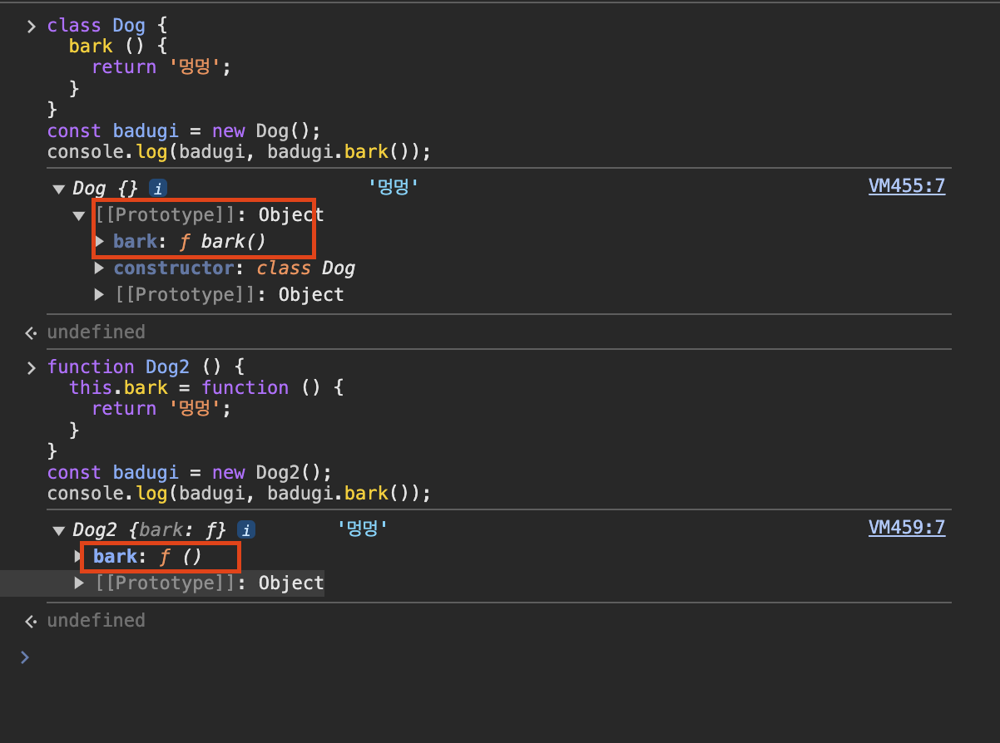
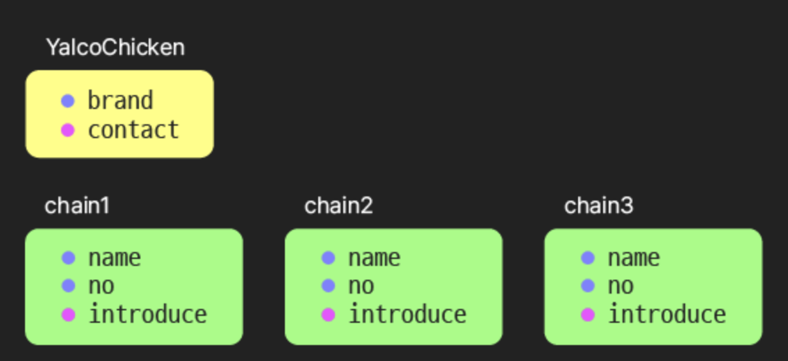

# I. 클래스 class를 사용하여 인스턴스 만들기

```js
class YalcoChicken {
  constructor(name, no) {
    this.name = name;
    this.no = no;
  }
  introduce() {
    // 💡 메서드
    return `안녕하세요, ${this.no}호 ${this.name}점입니다!`;
  }
}
```

```js
const chain1 = new YalcoChicken("판교", 3);
const chain2 = new YalcoChicken("강남", 17);
const chain3 = new YalcoChicken("제주", 24);
```

```js
console.log(chain1, chain1.introduce());
console.log(chain2, chain2.introduce());
console.log(chain3, chain3.introduce());
```

## 💡 Syntactic Sugar - 문법을 보다 읽기 쉽게 만드는 것

- 자바 등 타 언어에 익숙한 사람들을 위해 생성자 함수, 프로로타입 기반인
  자바스크립트 문법 타 언어의 클래스와 비슷한 문법으로 포장

### ⚠️ 그러나 클래스와 생성자 함수의 동작이 동일하지는 않음

```js
// 차이 1. 클래스는 호이스팅되지 않음 (정확히는 되지만...)
const chain1 = new YalcoChicken("판교", 3);

class YalcoChicken {
  constructor(name, no) {
    this.name = name;
    this.no = no;
  }
  introduce() {
    return `안녕하세요, ${this.no}호 ${this.name}점입니다!`;
  }
}
```

```js
// 차이 2. 클래스는 new 없이 사용하면 오류
// (생성자 함수는 오류 없이 undefined 반환)
const chain2 = YalcoChicken("강남", 17);
```

- 이 외에도 차이들이 있음 - 클래스에는 이후 배울 엄격 모드 적용

# II. constructor 메서드

- 인스턴스 생성시 인자를 받아 프로퍼티를 초기화함
- 클래스에 하나만 있을 수 있음 - 초과시 오류 발생
- 다른 메서드 이름을 쓸 수 없음
- 기본값 사용 가능
- 필요없을 (인자가 없을 때 등) 시 생략 가능
- ⚠️ 값을 반환하지 말 것! 생성자 함수처럼 암묵적으로 this 반환

```js
class Person {
  constructor(name, age, married = false) {
    this.name = name;
    this.age = age;
    this.married = married;
  }
}

const person1 = new Person("박영희", 30, true);
const person2 = new Person("오동수", 18);
console.log(person1, person2);
```

```js
// 인스턴스 초기화가 필요없는 클래스
class Empty {}
console.log(new Empty());
```

# III. 클래스의 메서드

```js
class Dog {
  bark() {
    return "멍멍";
  }
}
const badugi = new Dog();
console.log(badugi, badugi.bark());
```

💡 생성자 함수에 넣은 함수의 차이 - 프로토타입으로 들어감

- 로그 펼쳐서 비교해볼 것

```js
function Dog2() {
  this.bark = function () {
    return "멍멍";
  };
}
const badugi = new Dog2();
console.log(badugi, badugi.bark());
```



# IV. 필드 field

- constructor 밖에서, this.~ 없이 인스턴스의 프로퍼티 정의
- 2022 말 아직은 제안사항 (이후 🧪로 표시), 이미 다수 브라우저에서 지원
- 이후 배울 Babel로 해결 가능

```js
// 필드값이 지정되어 있으므로 constructor 메서드 필요없음
class Slime {
  hp = 50;
  op = 4;
  attack(enemy) {
    enemy.hp -= this.op;
    this.hp += this.op / 4;
  }
}
```

```js
const slime1 = new Slime();
const slime2 = new Slime();

console.log(slime1, slime2);
```

```js
slime1.attack(slime2);
```

```js
console.log(slime1, slime2);
```

```js
class YalcoChicken {
  no = 0;
  menu = { 후라이드: 10000, 양념치킨: 12000 };

  constructor(name, no) {
    this.name = name;
    if (no) this.no = no;
  }
  introduce() {
    return `안녕하세요, ${this.no}호 ${this.name}점입니다!`;
  }
  order(name) {
    return `${this.menu[name]}원입니다.`;
  }
}
```

```js
const chain0 = new YalcoChicken("(미정)");
console.log(chain0, chain0.introduce());
```

```js
const chain1 = new YalcoChicken("판교", 3);
console.log(chain1, chain1.introduce());
```

```js
chain1.menu["양념치킨"] = 13000;

console.log(chain0.order("양념치킨"), chain1.order("양념치킨"));
```

# V. 정적 static 필드와 메서드

```js
class YalcoChicken {
  // 정적 변수와 메서드
  static brand = "얄코치킨";
  static contact() {
    return `${this.brand}입니다. 무엇을 도와드릴까요?`;
  }

  constructor(name, no) {
    this.name = name;
    this.no = no;
  }
  introduce() {
    return `안녕하세요, ${this.no}호 ${this.name}점입니다!`;
  }
}

console.log(YalcoChicken);
console.log(YalcoChicken.contact());
```



- 인스턴스의 수와 관계없이 메모리 한 곳만 차지
- 인스턴스 없이 클래스 차원에서 호출
- ⚠️ 정적 메서드에서는 정적 필드만 사용 가능
- introduce 함수는 메서드이기 때문에 본체는 본사의 프로토타입 한 공간에 들어있습니다.(프로토타입 섹션에서 자세히 다룸)

## 💡 클래스는 함수

```js
class Dog {
  bark() {
    return "멍멍";
  }
}

console.log(typeof Dog);
```

```js
const 개 = Dog; // 할당될 수 있는 일급 객체
const 바둑이 = new 개();

console.log(바둑이); // 💡 콘솔에 나타난 타입 확인
```

- typeof시 function으로 구분
- 일급 객체, 다른 곳에 할당 가능
