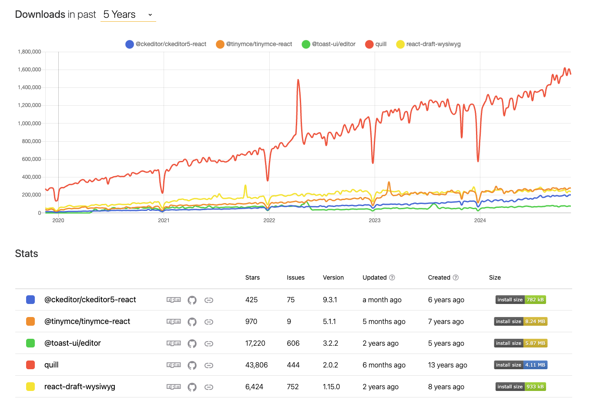

# 🖋️ Quill.js

**Quill.js**는 강력한 텍스트 에디터 라이브러리로, 사용자가 텍스트를 쉽게 작성 및 편집할 수 있도록 돕습니다.

Zoom, Figma와 같은 서비스에서도 활용되고 있습니다.

공식 문서: [Quill.js 공식 웹사이트](https://quilljs.com/)

---

## 📥 설치 방법

Quill.js를 React 프로젝트에서 활용하려면 `react-quill` 패키지를 설치하면 됩니다.
그 외 [Playground 참고](https://quilljs.com/playground/snow)

```bash
npm install react-quill
```

---

## 🔨 ReactQuill 사용 예제

아래는 `react-quill`을 활용하여 텍스트 편집기를 구현한 간단한 React 컴포넌트 예제입니다. 이 예제에서는 **Bubble 테마**를 적용하여 텍스트 입력 창을 생성합니다.

### 코드 예시

```javascript
import React, { useState } from "react";
import ReactQuill from "react-quill";
import "react-quill/dist/quill.bubble.css"; // Bubble 테마 CSS

const ReactQuillExample = () => {
  const [quillText, setQuillText] = useState(""); // 입력된 텍스트 상태 관리

  return (
    <div>
      <ReactQuill
        theme='bubble' // 테마 설정: bubble
        value={quillText} // 상태를 Quill에 연결
        onChange={(value) => setQuillText(value)} // 텍스트 변경 시 상태 업데이트
      />
    </div>
  );
};

export default ReactQuillExample;
```

**value 값(html 태그 형식)**

```html
<h1>안녕하세요<span style="color: rgb(230, 0, 0);"> 빨강 </span></h1>
<p><br /></p>
```

---

## 📘 주요 포인트

- **Bubble 테마**: Quill.js에서 제공하는 여러 테마 중 하나로, 간결하고 심플한 스타일을 제공합니다.
  - `import "react-quill/dist/quill.bubble.css";`를 통해 테마를 로드해야 합니다.
- **상태 관리**: `useState`를 이용해 입력된 텍스트를 관리하며, `onChange` 이벤트로 상태를 업데이트합니다.
- **유연한 확장성**: Quill.js는 다양한 플러그인 및 옵션을 제공하여 텍스트 편집기를 커스터마이징할 수 있습니다.

## 🧐 회고

오늘 회사에서 동료분이 텍스트 에디터 라이브러리 조사를 맡아 관련 문서를 정리해 공유해 주셨다.
그중에서도 Quill.js가 압도적으로 많이 사용되고, 사용법도 간단해 보여 인상적이었다.
그대신 복잡한 커스텀에는 한계가 있다는 것
나중에 블로그 편집기처럼 텍스트 에디터가 필요한 프로젝트에서 활용해 보고 싶다.

[Web Text Editor NPM Trand](https://npmtrends.com/@ckeditor/ckeditor5-react-vs-@tinymce/tinymce-react-vs-@toast-ui/editor-vs-quill-vs-react-draft-wysiwyg)

