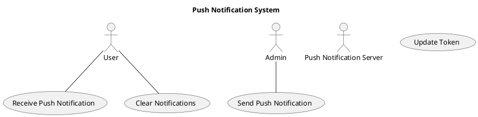

```plantuml
@startuml
title Push Notification System

actor User
actor Admin
actor "Push Notification Server" as Server

usecase "Send Push Notification" as UC1
usecase "Receive Push Notification" as UC2
usecase "Clear Notifications" as UC3
usecase "Update Token" as UC4

User -- UC2
User -- UC3
Admin -- UC1


@enduml


```

신기해 우와아아아아아아아아아ㅏㅇㅇ아ㅏㅏㅏ아ㅇ우와아아ㅏㅏㅏㅇ

